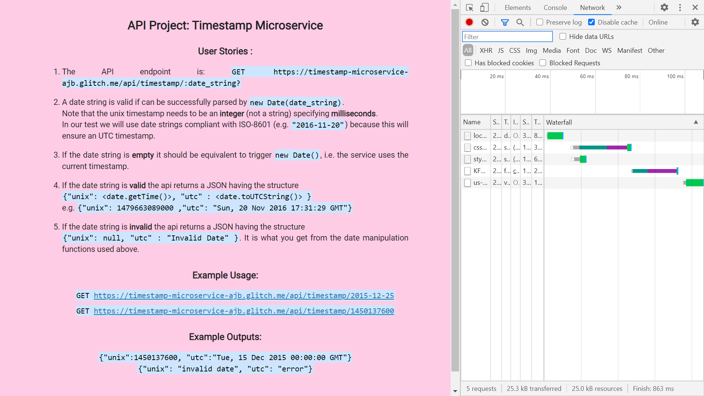
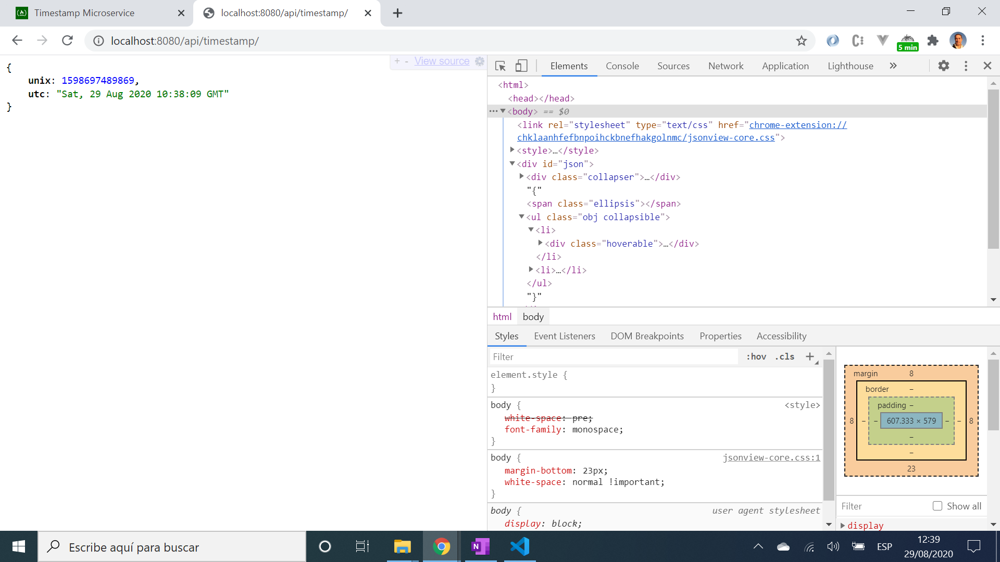

# :zap: Timestamp Microservice for FCC

* Returns unix and utc timestamps for date inputs or current date/time
* This was part of the FreeCodeCamp exercises for Front End Certification

**\* Note: to open web links in a new window use: _ctrl+click on link_**

## :page_facing_up: Table of contents

* [:zap: Timestamp Microservice for FCC](#zap-timestamp-microservice-for-fcc)
  * [:page_facing_up: Table of contents](#page_facing_up-table-of-contents)
  * [:books: General info](#books-general-info)
  * [:camera: Screenshots](#camera-screenshots)
  * [:signal_strength: Technologies](#signal_strength-technologies)
  * [:floppy_disk: Setup](#floppy_disk-setup)
  * [:computer: Code Examples](#computer-code-examples)
  * [:cool: Features](#cool-features)
  * [:clipboard: Status & To-Do List](#clipboard-status--to-do-list)
  * [:clap: Inspiration](#clap-inspiration)
  * [:envelope: Contact](#envelope-contact)

## :books: General info

* Original instructions (User Stories) from FCC:

1. The API endpoint is `GET [project_url]/api/timestamp/:date_string?`
2. A date string is valid if it can be successfully parsed by `new Date(date_string)` (JS) . Note that the unix timestamp needs to be an **integer** (not a string) specifying **milliseconds**. In our test we will use date strings compliant with ISO-8601 (e.g. `"2016-11-20"`) because this will ensure an UTC timestamp.
3. If the date string is **empty** it should be equivalent to trigger `new Date()`, i.e. the service uses the current timestamp.
4. If the date string is **valid** the api returns a JSON having the structure
`{"unix": <date.getTime()>, "utc" : <date.toUTCString()> }`
e.g. `{"unix": 1479663089000 ,"utc": "Sun, 20 Nov 2016 17:31:29 GMT"}`.
5. If the date string is **invalid** the api returns JSON having the structure `{"unix": null, "utc" : "Invalid Date" }`. It is what you get from the date manipulation functions used above.

## :camera: Screenshots

.
.

## :signal_strength: Technologies

* [Node v12](https://nodejs.org/en/) javaScript runtime built on Chrome's V8 JavaScript engine
* [Express v5](https://expressjs.com/) Fast, unopinionated, minimalist web framework for Node.js
* [body-parser v1](https://www.npmjs.com/package/body-parser) to parse incoming request bodies in middleware before handlers
* [Cors v2](https://www.npmjs.com/package/cors) node.js package for providing Connect/Express middleware that can be used to enable CORS with various options.

## :floppy_disk: Setup

* Run `npm run start` or `node server.js` for a dev server.
* Navigate to `http://localhost:8080/` for home screen.
* Navigate to `http://localhost:8080/api/timestamp/` for current time stamp
* Navigate to `http://localhost:8080/api/timestamp/2020-08-29` date-string for example to see json object with unix and utc timestamps
* Navigate to `http://localhost:8080/api/timestamp/1598659200` unix timestamp for example to see json object with unix and utc timestamps
* The app will not automatically reload if you change any of the source files.

## :computer: Code Examples

* extract from `server.js` to return current timestamp

```javascript
// API endpoint for no date entry...
app.get("/api/timestamp/", function (req, res) {
  let dateNow = new Date()
  let unixDateNow = dateNow
  res.json({
    unix: dateNow.getTime(),
    utc: dateNow.toUTCString()
  });
});
```

## :cool: Features

* unix and utc timestamps shown

## :clipboard: Status & To-Do List

* Status: Working
* To-Do: Old code that uses `var` a lot - whole thing should be rewritten to declare variables at beginning and use `let` and `const`

## :clap: Inspiration

* [freeCodeCamp's APIs and Microservices Projects - Timestamp Microservice](https://www.freecodecamp.org/learn/apis-and-microservices/apis-and-microservices-projects/timestamp-microservice)
* [Express doc: Serving static files in Express](http://expressjs.com/en/starter/static-files.html) such as images, CSS files, and JavaScript files
* [Express doc: Basic Routing](http://expressjs.com/en/starter/basic-routing.html) basic structure: `app.METHOD(PATH, HANDLER)`

## :envelope: Contact

* Repo created by [ABateman](https://www.andrewbateman.org) - you are welcome to [send me a message](https://andrewbateman.org/contact)
